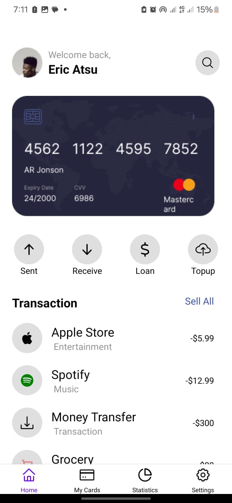
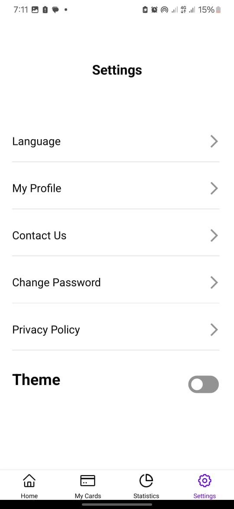
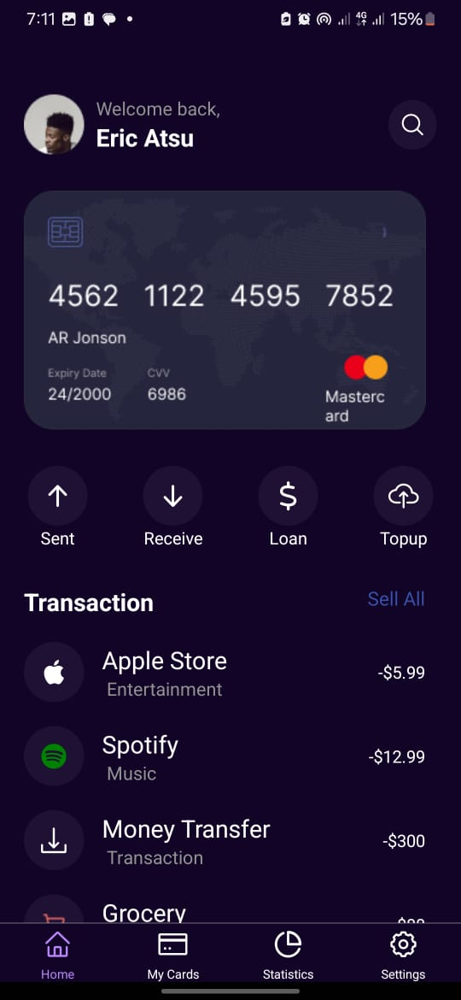
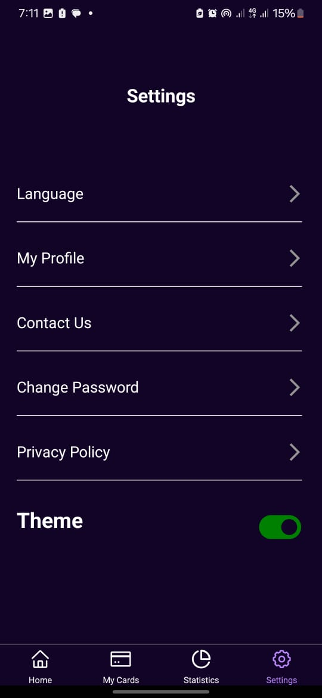

# 11215194

## Description

I built this application using ReactNative with Expo as its package management. The main aim of this application is to learn how useContext and useState work and how they can be utilised to implement dark mode features.

## The process of building.

I  started by installing a blank React native app using Expo. Afterwards, other packages and dependencies. Afterward I developed the application structure by dividing files and folders into reusable components. This gives the codebase an organized outlook.

I then moved on with building my screens. I began by developing the HomeScreen to match the provided UI design(light theme), then went ahead to implement the dark theme feature.
This approach was followed to create the Settings screen.

As mentioned above, components were used throughout the application. I created components that will display the actions a user can perform and the transactions that have been performed.
NB: The dark theme feature was implemented in these components, using react native useContext and useState hooks.

A toggle button was also added in the Settings screen to allow users to switch between the dark and light themes.

## Conclusion!
[Light theme of the HomeScreen](HomeScreen-light.jpeg)

